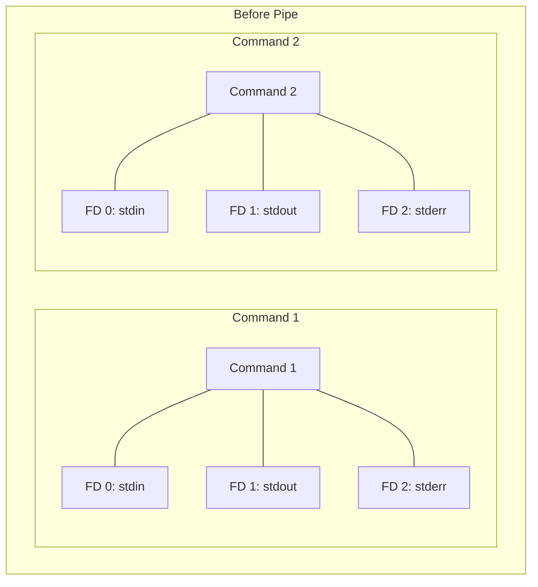
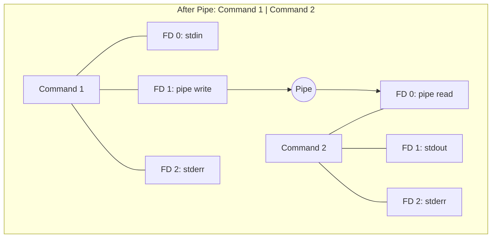

# Understanding Pipes in Command Line

## Before Pipe

In this initial state, each command has its own standard input (stdin), standard output (stdout), and standard error (stderr) streams. These are typically connected to the terminal or other default sources/destinations.

## After Pipe: Command 1 | Command 2

When a pipe is used:

1. Command 1's stdout (FD 1) is connected to the write end of the pipe.
2. Command 2's stdin (FD 0) is connected to the read end of the pipe.
3. This allows the output of Command 1 to be directly fed as input to Command 2.
4. stderr (FD 2) for both commands typically remains connected to the terminal.
5. Command 1's stdin and Command 2's stdout also typically remain connected to the terminal.

The pipe acts as a buffer, allowing data to flow from Command 1 to Command 2 without needing to be stored in a temporary file or displayed on the screen.
