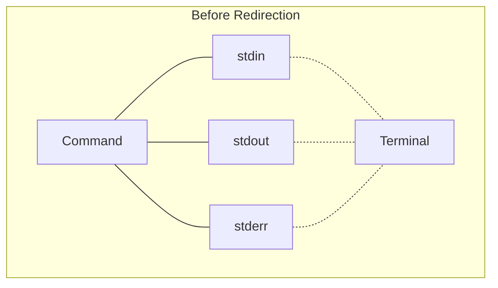
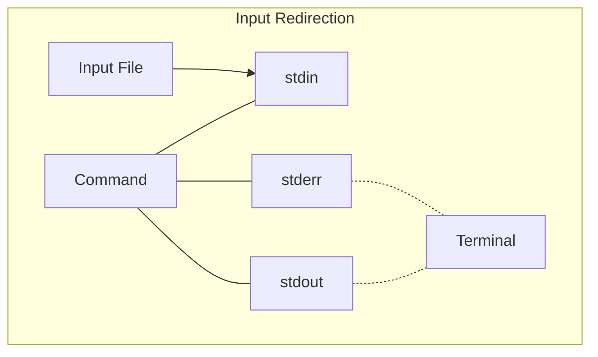
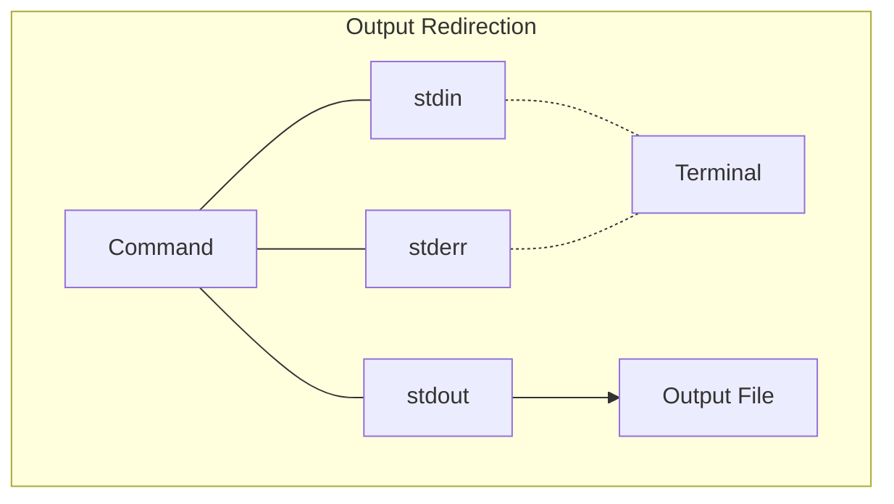
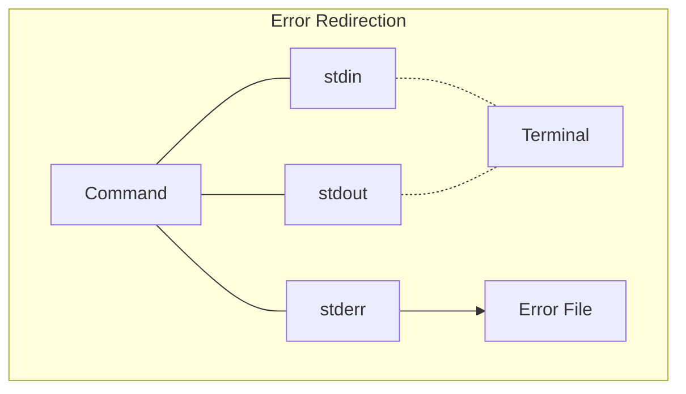

# Understanding Redirections in Command Line

## Before Redirection

In the initial state, a command's standard input (stdin), standard output (stdout), and standard error (stderr) are typically connected to the terminal. This means:
- Input is read from the keyboard
- Output is displayed on the screen
- Error messages are also displayed on the screen

## After Input Redirection: command < input_file

When input is redirected:
1. The command's stdin is connected to the specified input file instead of the keyboard.
2. The command reads its input from the file rather than waiting for user input.
3. stdout and stderr typically remain connected to the terminal.

## After Output Redirection: command > output_file

When output is redirected:
1. The command's stdout is connected to the specified output file instead of the screen.
2. The command's output is written to the file rather than displayed on the terminal.
3. stdin typically remains connected to the keyboard, and stderr to the terminal.

## After Error Redirection: command 2> error_file

When error output is redirected:
1. The command's stderr is connected to the specified error file instead of the screen.
2. Error messages are written to the file rather than displayed on the terminal.
3. stdin and stdout typically remain connected to the terminal.

## Notes on Redirections:
- Input redirection (`<`) changes where the command reads its input from.
- Output redirection (`>`) changes where the command sends its output to.
- Error redirection (`2>`) changes where the command sends its error messages to.
- You can combine redirections, e.g., `command < input_file > output_file 2> error_file`
- Use `>>` for appending output to a file instead of overwriting it.
- Use `2>&1` to redirect stderr to the same place as stdout.

Redirections allow you to control the input and output streams of commands, enabling more flexible and powerful command-line operations.
