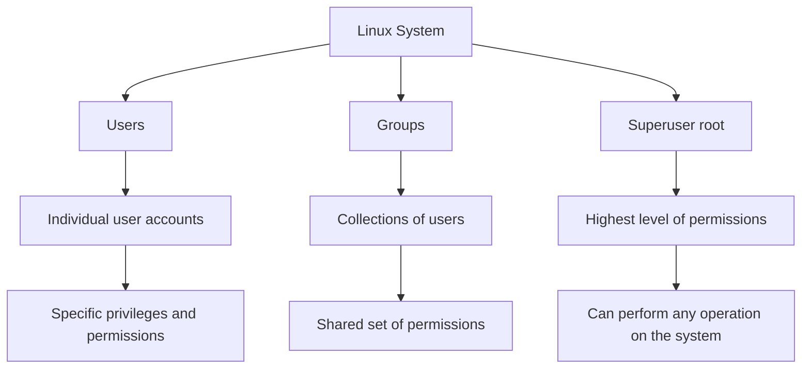
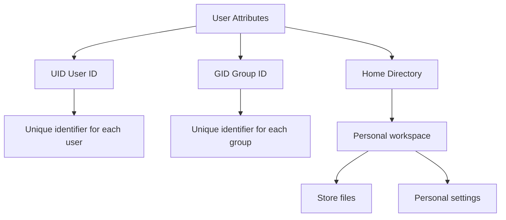
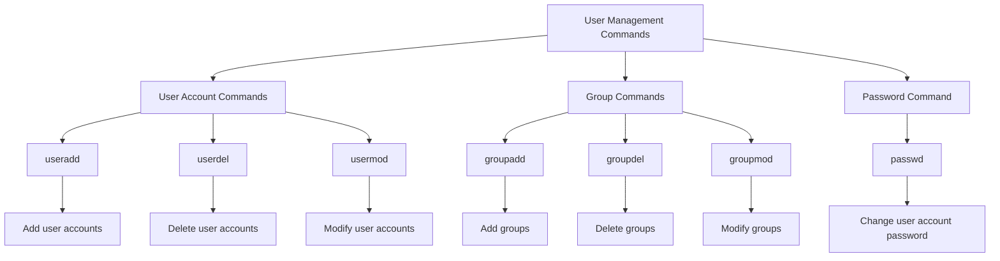
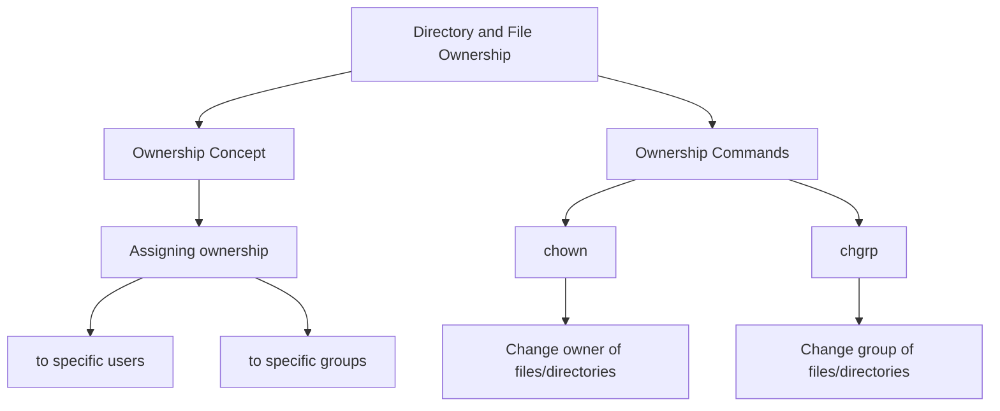
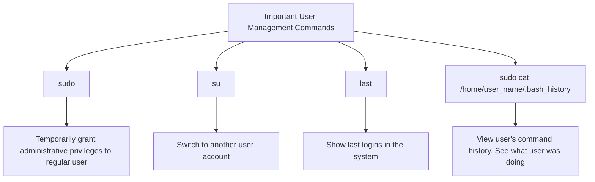

# Comprehensive Guide to Linux User Management

This guide provides an overview of key concepts and commands related to user management in Linux systems. We'll cover users and groups, user attributes, management commands, file ownership, and important administrative commands.

## 1. Users and Groups

Linux systems manage access and permissions through users and groups. Here's a basic overview:

- **Users**: Individual accounts with specific privileges and permissions.
- **Groups**: Collections of users that share a common set of permissions.
- **Superuser (root)**: The user with the highest level of permissions, capable of performing any operation on the system.

## 2. User Attributes

Each user in a Linux system has several important attributes:

- **UID (User ID)**: A unique identifier assigned to each user.
- **GID (Group ID)**: A unique identifier assigned to each group.
- **Home Directory**: The personal workspace for each user to store their files and personal settings.

## 3. User Management Commands

Linux provides several commands for managing users and groups:

- **User Account Commands**:
  - `useradd`: Add new user accounts
  - `userdel`: Delete user accounts
  - `usermod`: Modify existing user accounts
- **Group Commands**:
  - `groupadd`: Add new groups
  - `groupdel`: Delete groups
  - `groupmod`: Modify existing groups
- **Password Command**:
  - `passwd`: Change the password of a user account

## 4. Directory and File Ownership

In Linux, every file and directory is owned by a specific user and group:

- **Ownership**: Files and directories are assigned to specific users or groups.
- **Ownership Commands**:
  - `chown`: Change the owner of files or directories
  - `chgrp`: Change the group of files or directories

## 5. Important Administrative Commands

These commands are crucial for system administration and user management:

- `sudo`: Temporarily grant administrative privileges to a regular user.
- `su`: Switch to another user account.
- `last`: Show the last logins in the system.
- `sudo cat /home/user_name/.bash_history`: View a user's command history to see what they were doing.

This guide provides a comprehensive overview of Linux user management, covering the basic concepts, attributes, commands, and administrative tools necessary for effective user and group management in a Linux system.
