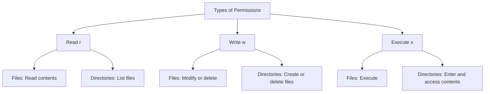
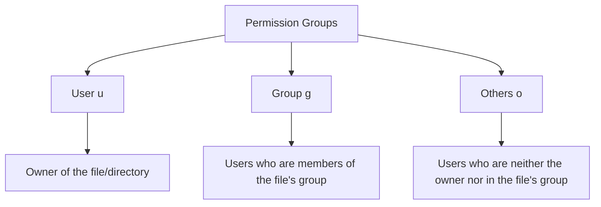
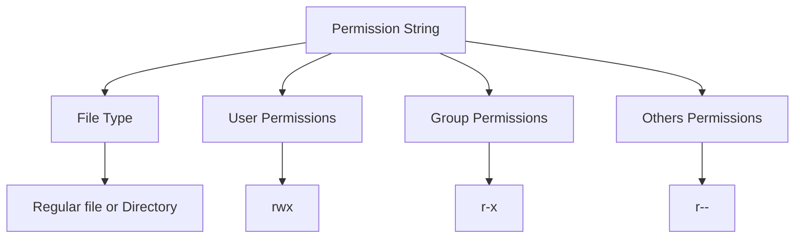
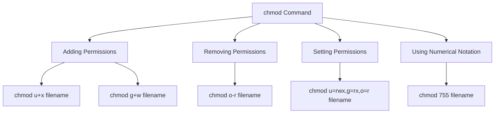
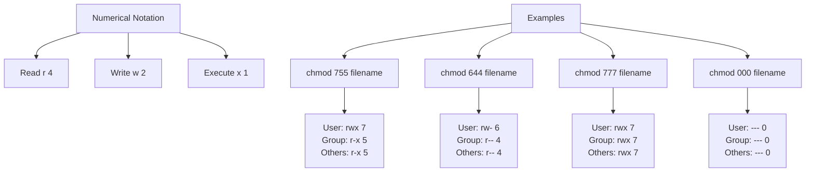
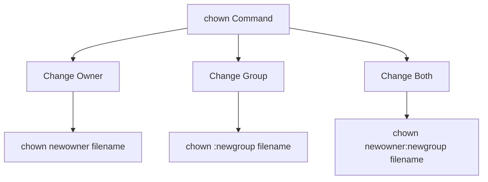

# Comprehensive Guide to Linux File Permissions and Ownership

In Linux and other Unix-like operating systems, the permission and access rights system is a crucial security feature. It controls the level of access and interaction users and processes can have with files and directories.

## 1. Types of Permissions

Linux systems have three basic types of permissions:



- **Read (r)**:
  - Files: Allows a user to read the contents of a file.
  - Directories: Allows a user to list the files in the directory.
- **Write (w)**:
  - Files: Allows a user to modify a file or delete it.
  - Directories: Allows a user to create new files or delete files in the directory.
- **Execute (x)**:
  - Files: Allows a user to execute a file.
  - Directories: Allows a user to enter the directory and access files and directories inside.

## 2. Permission Groups

Permissions are defined for three groups:



- **User (u)**: The owner of the file/directory.
- **Group (g)**: Users who are members of the file's group.
- **Others (o)**: Users who are neither the file owner nor members of the file's group.

## 3. Viewing Permissions

To view the permissions of a file or directory, use the `ls -l` command. The permission field will look something like this:

```
-rwxr-xr--
```

For a full picture, you can use the `stat` command to display file or directory permissions.



- The first character indicates the type of file (- for a regular file, d for a directory).
- The next three characters represent the user permissions (rwx).
- The next three represent the group permissions (r-x).
- The last three represent the permissions for others (r--).

## 4. Modifying Permissions

To modify the permissions of a file or directory, use the `chmod` command.



Here are some examples:

- Adding permissions:
  - `chmod u+x filename` # Add execute permission for the user
  - `chmod g+w filename` # Add write permission for the group
- Removing permissions:
  - `chmod o-r filename` # Remove read permission for others
- Setting permissions:
  - `chmod u=rwx,g=rx,o=r filename` # Set permissions explicitly for user, group, and others
- Using numerical notation:
  - `chmod 755 filename` # Equivalent to u=rwx,g=rx,o=rx

## 5. Numerical Notation for Permissions

In Linux, numerical notations for file permissions are derived from the binary representation of the permissions for the user, group, and others. Each of these entities can have a permission value between 0 and 7, represented as a three-bit binary number.



Here's the full breakdown of the numerical notations:

| Octal Value | Binary Representation | Permission (rwx notation) |
|-------------|------------------------|---------------------------|
| 0           | 000                    | ---                       |
| 1           | 001                    | --x                       |
| 2           | 010                    | -w-                       |
| 3           | 011                    | -wx                       |
| 4           | 100                    | r--                       |
| 5           | 101                    | r-x                       |
| 6           | 110                    | rw-                       |
| 7           | 111                    | rwx                       |

## 6. Ownership

To change the ownership of a file or directory, use the `chown` command.



Here are some examples:
- Changing the owner: `chown newowner filename`
- Changing the group: `chown :newgroup filename`
- Changing both owner and group: `chown newowner:newgroup filename`

## 7. Practical Labs

To practice these concepts, you can try the following labs:

1. Creating a new user and groups
2. Manipulating file permissions

These labs will help you apply the concepts of file permissions and ownership in a practical setting.

This guide provides a comprehensive overview of Linux file permissions and ownership, covering the basic concepts, viewing and modifying permissions, numerical notation, and changing ownership. Understanding these concepts is crucial for managing file security and access control in Linux systems.
