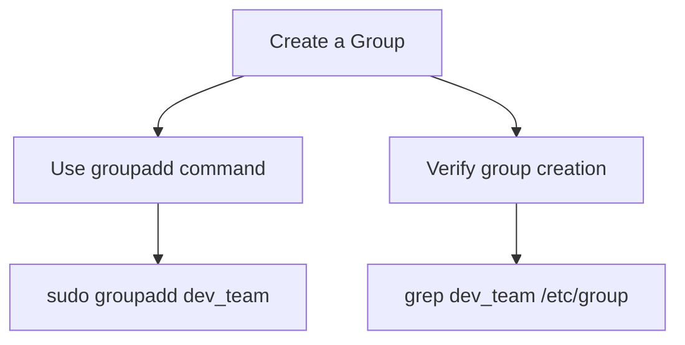
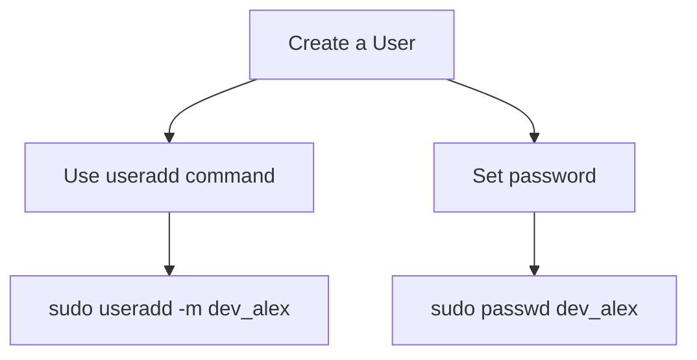
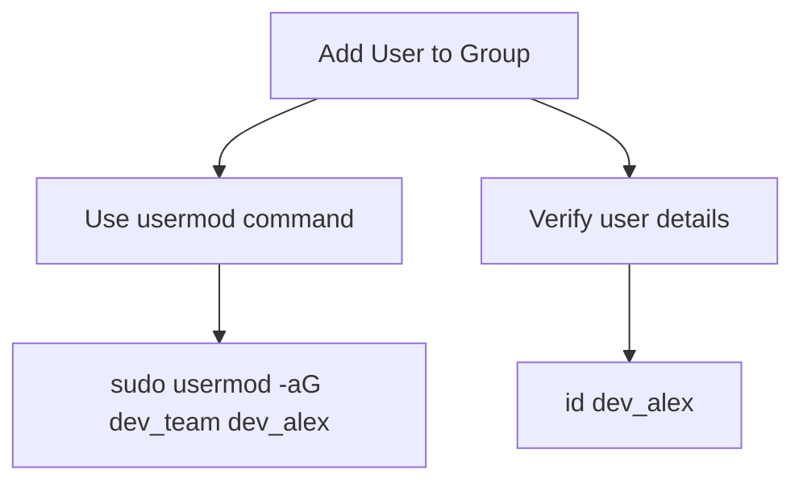
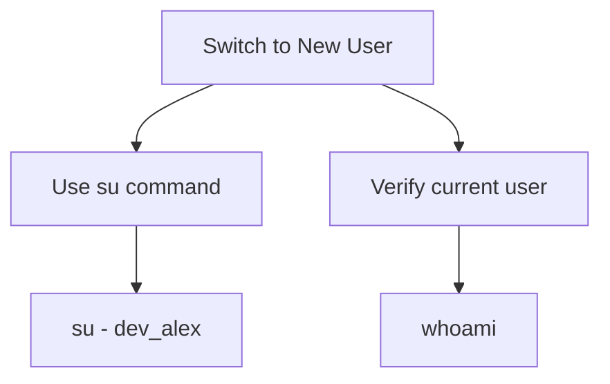
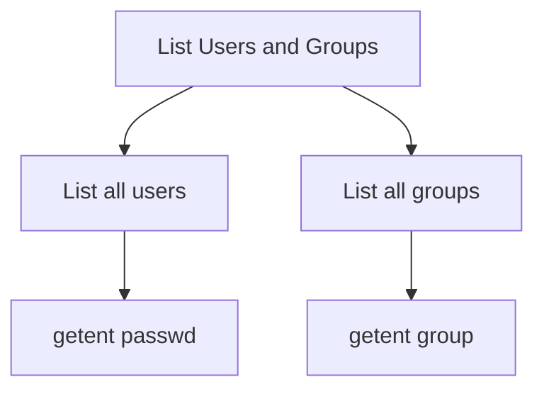

# Comprehensive Guide to Creating Users and Groups in Linux

This guide provides step-by-step instructions on how to create, manage, and delete users and groups in Linux systems.

## 1. Opening the Terminal

All actions in this guide are performed from the terminal. Open your terminal to begin.

## 2. Creating a Group

Before creating a user, you may want to create a group. 



To create a group:
1. Use the `groupadd` command followed by the group name:
   ```
   $ sudo groupadd dev_team
   ```
2. Verify that the group has been created by checking the `/etc/group` file:
   ```
   $ grep dev_team /etc/group
   ```

## 3. Creating a User

To create a user, use the `useradd` command.



1. Create a user with a home directory:
   ```
   $ sudo useradd -m dev_alex
   ```
   The `-m` option creates a home directory for the user.

2. Set a password for the new user:
   ```
   $ sudo passwd dev_alex
   ```
   You will be prompted to enter and confirm a password for the user.

## 4. Adding the User to a Group

To add the user to the group you created earlier, use the `usermod` command.



1. Add the user to the group:
   ```
   $ sudo usermod -aG dev_team dev_alex
   ```
   The `-aG` option appends the user to the supplementary groups mentioned.

2. Verify the user's details with the `id` command:
   ```
   $ id dev_alex
   ```
   The output will display the user's UID, GID, and the groups the user belongs to.

## 5. Switching to the New User

To switch to the new user's environment:



1. Use the `su` command:
   ```
   $ su - dev_alex
   ```

2. Verify that you are logged in as the new user:
   ```
   $ whoami
   ```

## 6. Deleting Users and Groups

If necessary, users and groups can be deleted:


- To delete a user:
  ```
  $ sudo userdel dev_alex
  ```

- To delete a group:
  ```
  $ sudo groupdel dev_team
  ```

**Note:** Be cautious when deleting users and groups, as this action can result in loss of data and system instability.

## 7. Listing All Users and Groups

To list all users and groups on a Linux system:



- To list all users:
  ```
  $ getent passwd
  ```

- To list all groups:
  ```
  $ getent group
  ```

## Important Files and Commands

- `/etc/passwd` file: Contains information about the users on the system.
- `/etc/group` file: Contains information about groups on the system.
- `getent` command: Used to get entries from Name Service Switch libraries.

## Conclusion

Now you know how to create, modify, and delete users and groups in Linux. It's always recommended to perform such actions with care to maintain system security and integrity. Practice these operations to get comfortable with user and group management in Linux. Once you feel ready, you can proceed with more advanced tasks like configuring file permissions and ownership.
