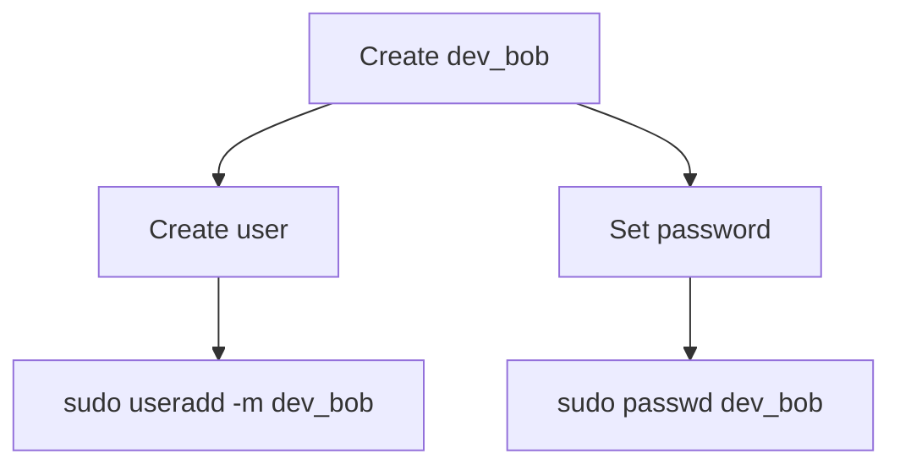
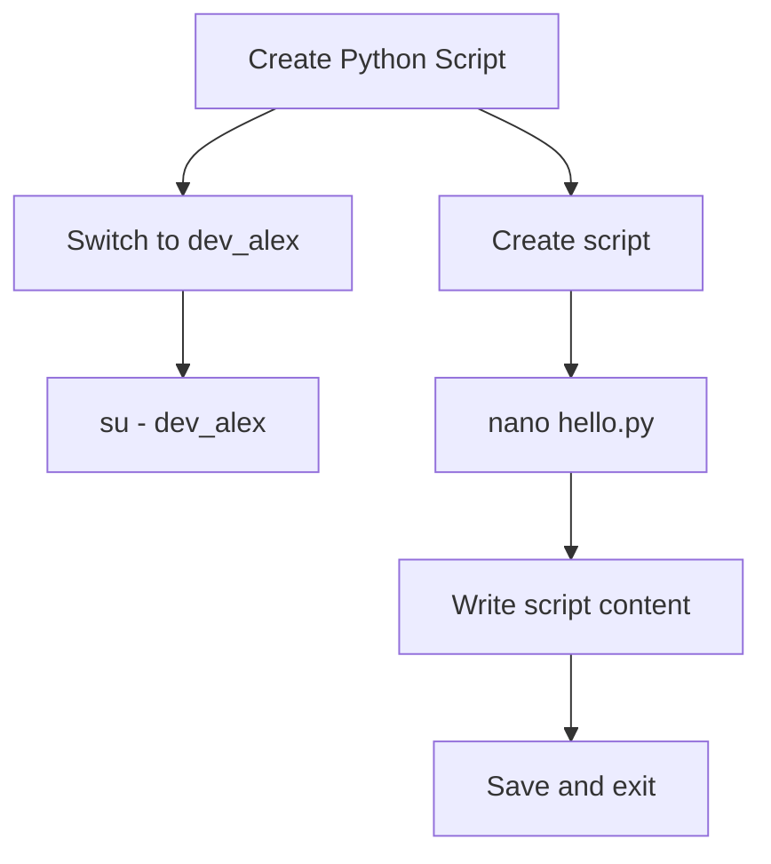
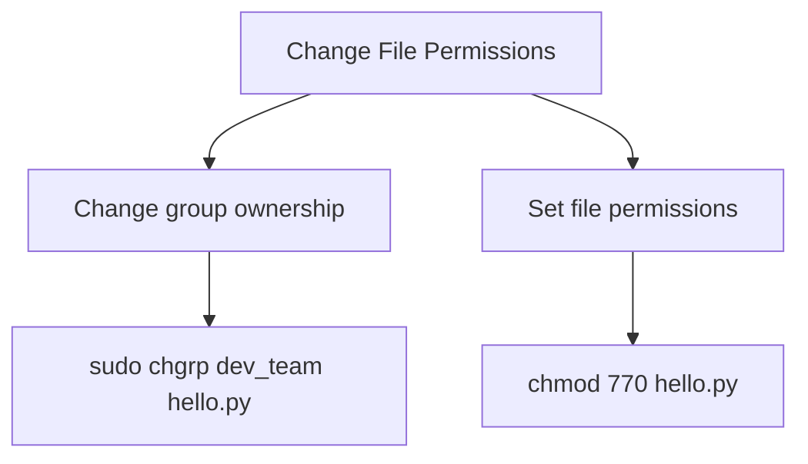
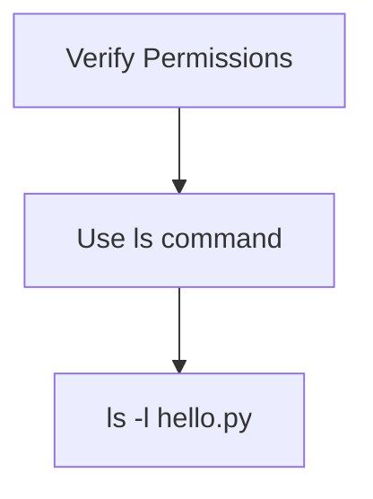
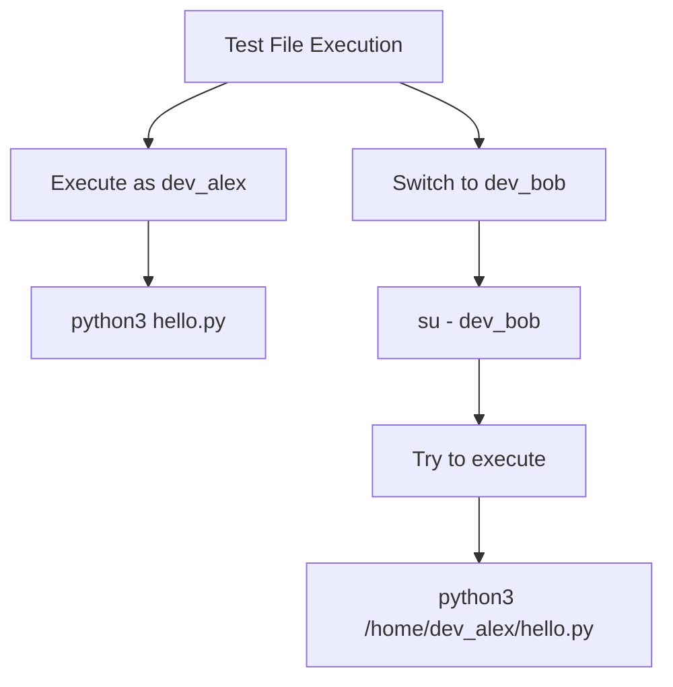
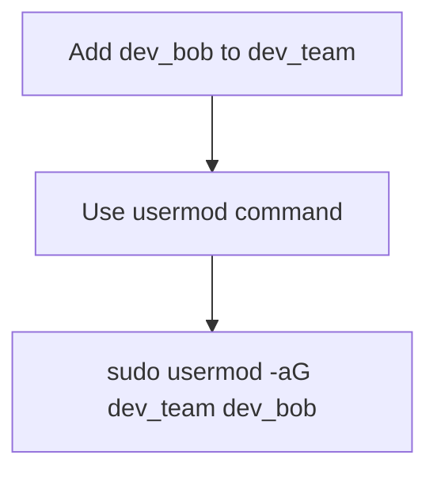
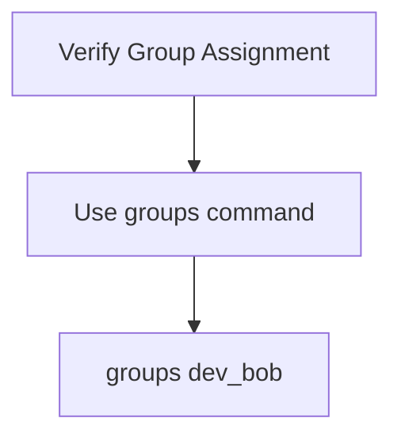
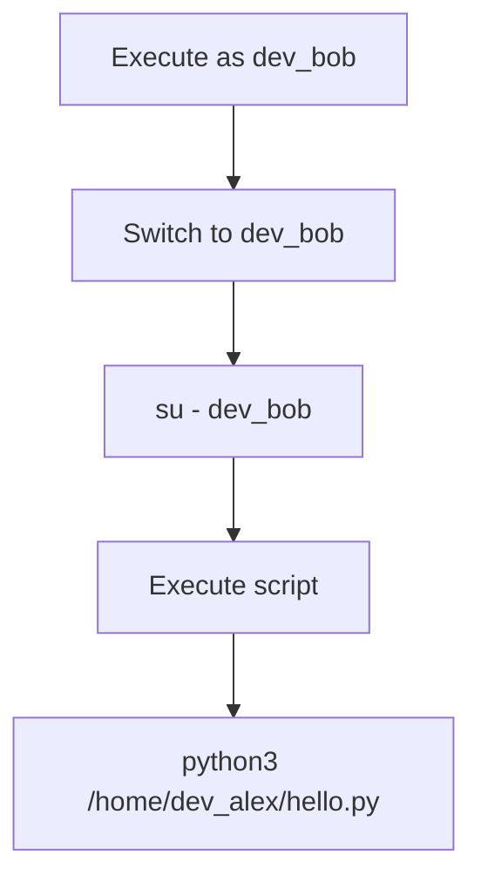

# Lab 2: Setting File Permissions in Linux 

**Important Note:** This lab is a continuation of the previous lab on creating users and groups. It assumes you have completed Lab 1 and have the users and groups (specifically dev_alex and dev_team) already set up. These labs should be done together to ensure all necessary components are in place.

## Step 1: Create Another User

First, we'll create a new user named dev_bob.



1. Open the terminal and create a new user, dev_bob:
   ```
   $ sudo useradd -m dev_bob
   ```
   The `-m` option creates a home directory for the user.

2. Set a password for dev_bob:
   ```
   $ sudo passwd dev_bob
   ```
   You will be prompted to enter and confirm a password for dev_bob.

## Step 2: Log In as dev_alex and Create a Python Script

Now, we'll switch to dev_alex and create a simple Python script.



1. Switch to the dev_alex user:
   ```
   $ su - dev_alex
   ```

2. Create a Python script called hello.py using a text editor. We'll use nano:
   ```
   $ nano hello.py
   ```

3. In the editor, type the following Python code:
   ```python
   print("Hello, dev_team!")
   ```

4. Save and exit the editor (for nano: Ctrl+O to write changes, Ctrl+X to exit).

## Step 3: Change File Permissions

We'll modify the file permissions so only users in the dev_team group can execute the script.



1. First, change the group ownership of the file to dev_team:
   ```
   $ sudo chgrp dev_team hello.py
   ```

2. Next, set the file permissions to allow execution by the group:
   ```
   $ chmod 770 hello.py
   ```
   This sets read, write, and execute permissions for the owner and group, and no permissions for others.

## Step 4: Verify the File Permissions

Check the new file permissions.



Verify the permissions using the ls command:
```
$ ls -l hello.py
```
The output should indicate that the file owner and group members have read, write, and execute permissions, while others have no permissions. It should look something like this:
```
-rwxrwx--- 1 dev_alex dev_team 28 Sep 22 10:00 hello.py
```

## Step 5: Test the File Execution

We'll test executing the script as different users.



1. First, try executing the script as dev_alex:
   ```
   $ python3 hello.py
   ```
   You should see the output: "Hello, dev_team!"

2. Next, switch to the dev_bob user and try executing the script:
   ```
   $ su - dev_bob
   $ python3 /home/dev_alex/hello.py
   ```
   dev_bob should not have the permissions to execute the script, and you should see a permission denied error.

## Step 6: Adding dev_bob to the dev_team Group

Now, we'll add dev_bob to the dev_team group.



Switch back to a user with sudo privileges and add dev_bob to the dev_team group:
```
$ sudo usermod -aG dev_team dev_bob
```

## Step 7: Verify the Group Assignment for dev_bob

We'll verify that dev_bob has been added to the dev_team group.



Verify that dev_bob has been added to the dev_team group:
```
$ groups dev_bob
```
You should see dev_team in the list of groups for dev_bob.

## Step 8: Log In as dev_bob and Execute the Script

Finally, we'll test if dev_bob can now execute the script.



1. Switch to the dev_bob user:
   ```
   $ su - dev_bob
   ```

2. Now, navigate to dev_alex's home directory and try running the script:
   ```
   $ python3 /home/dev_alex/hello.py
   ```
   This time, since dev_bob is a member of the dev_team group, he should be able to execute the script, and you should see the "Hello, dev_team!" message output to the terminal.

## Conclusion

This lab demonstrated how to:
- Create additional users
- Create and modify file permissions
- Test file access with different user accounts
- Add users to groups and observe how it affects their access rights

These skills are fundamental for managing file security and access control in Linux systems. Remember, the scenarios in this lab build upon the user and group setup from Lab 1. Always ensure you have the necessary prerequisites in place when working through multi-part labs or tutorials.

## Important Commands Used
- `useradd`: Add a new user
- `passwd`: Set or change a user's password
- `su`: Switch user
- `chgrp`: Change group ownership of a file
- `chmod`: Change file permissions
- `ls -l`: List files with detailed information, including permissions
- `usermod`: Modify a user account
- `groups`: Display group membership for a user

Practice these operations to get comfortable with user, group, and file permission management in Linux.
