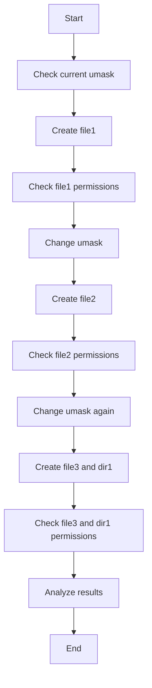

# Lab 3: Understanding Umask in Linux

## Theory

In Linux, every time a file or a directory is created, it is assigned a set of default permissions. These permissions are governed by a parameter known as umask. This lab will help you understand and set the umask value to control the default permissions.

### Default Permissions
- Files: 666 (rw-rw-rw-)
- Directories: 777 (rwxrwxrwx)

### Umask
The umask command and function are utilized to determine the default permission settings for files and directories created on a Linux system.

### Umask Values and Representation

Octal Representation and Corresponding Permissions:

```
Octal Digit | Binary Representation | File Permissions (rwx Notation)
----------------------------------------------------------------------
     0      |        000           |                 ---
     1      |        001           |                 --x
     2      |        010           |                 -w-
     3      |        011           |                 -wx
     4      |        100           |                 r--
     5      |        101           |                 r-x
     6      |        110           |                 rw-
     7      |        111           |                 rwx
```

### Understanding Umask 0002

To dissect a umask value of 0002:

- 0: The first digit handles special permissions; it is 0 here, indicating no special permissions are utilized.
- 0: This digit represents the permissions for the user (or the file owner). No permissions are masked here, retaining the full permissions defined by default system settings.
- 0: Here, the group permissions are dictated, and no permissions are masked for the group as well.
- 2: The last digit represents the permissions for others. An octal value of 2 corresponds to a write (w) permission, indicating that write permission is being masked, or removed, for others.

### Applying Umask

To apply the umask, you remove the permissions indicated by the umask value from the default permissions set for files and directories.

For instance, considering a file with default permissions as 666 (rw-rw-rw-) and applying a umask of 0002:

```
Default file permissions: 666 (rw-rw-rw-)
Umask value:              002 
-----------------------------
Resulting permissions:    664 (rw-rw-r--)
```

In this scenario, the "others" category has write permissions removed, resulting in read-only permissions.

### Understanding Umask through Bitwise Operations

To apprehend the intricacies of umask, we delve deep into how it operates using bitwise operations. The operations include bitwise NOT and AND to determine the final permissions set on a file or directory.

Step by Step Process with Umask 0002

**Step 1: Identify the Default Permissions**

For a file: 666, which translates to 110 110 110 in binary.

```
┌───────────────────────────────────┐
│ Default Permissions: 110 110 110  │
└───────────────────────────────────┘
```

**Step 2: Identify the Umask Value**

In our example, it is 0002, which translates to 000 000 010 in binary.

```
┌───────────────────────────────┐
│ Umask Value: 000 000 010      │
└───────────────────────────────┘
```

**Step 3: Apply the NOT Operation on Umask**

Applying the NOT operation on each bit of the umask value to invert it.

```
┌─────────────────────────────┐
│ Original Umask: 000 000 010 │
└─────────────────────────────┘
┌─────────────────────────────┐
│ Inverted Umask: 111 111 101 │
└─────────────────────────────┘
```

**Step 4: Apply the AND Operation with Default Permissions**

Next, we apply the AND operation, taking each corresponding bit from the 
default permissions and the inverted umask value, 
and applying the AND operation to them.

```
┌──────────────────────────────────────┐
│ Default Permissions: 110 110 110     │
│ Inverted Umask:      111 111 101     │
│                     ───────────────  │
│ Result (bitwise AND): 110 110 100    │
└──────────────────────────────────────┘
```

**Step 5: Translate the Final Binary to Octal**

The final binary value derived from the AND operation is translated 
back to octal to understand the permissions in a more human-readable form.

```
┌──────────────────────────┐
│ Binary: 110 110 100      │
│ Octal:  664              │
└──────────────────────────┘
```

This final octal value, 664, now directly translates to the file permissions, 
showing a permission setting of rw-rw-r--.

## Practical Lab

Let's bring the theory into practice with a lab setup.

### Objective

To understand and experiment with umask and its influence on file and directory permissions.

### Setup

1. Launch your Linux terminal.
2. Create a lab directory:
   ```
   $ mkdir umask_lab
   ```
3. Move to the lab directory:
   ```
   $ cd umask_lab
   ```

### Exercise

1. Check the existing umask value:
   ```
   $ umask
   ```

2. Create a file:
   ```
   $ touch file1
   ```

3. Check file1's permissions:
   ```
   $ ls -l file1
   ```

4. Modify the umask value:
   ```
   $ umask 0022
   ```

5. Create another file:
   ```
   $ touch file2
   ```

6. Check file2's permissions:
   ```
   $ ls -l file2
   ```

### Experiment

Alter the umask value and create new files and directories to understand how umask manipulates their permissions. For instance:

```
$ umask 0077
$ touch file3
$ mkdir dir1
$ ls -l file3 dir1
```

Try different umask values and observe how they affect the permissions of newly created files and directories.



## Conclusion

Through this lab, it should be evident how the umask value controls the permissions of new files and directories. The knowledge of umask functioning aids in configuring appropriate permissions, fostering system security while facilitating necessary accesses.

Remember:
- Umask is subtracted from the default permissions.
- Lower umask values result in more permissive default permissions.
- Higher umask values result in more restrictive default permissions.
- Umask affects only newly created files and directories, not existing ones.

Practice setting different umask values and observe their effects to gain a deeper understanding of this important Linux concept.
