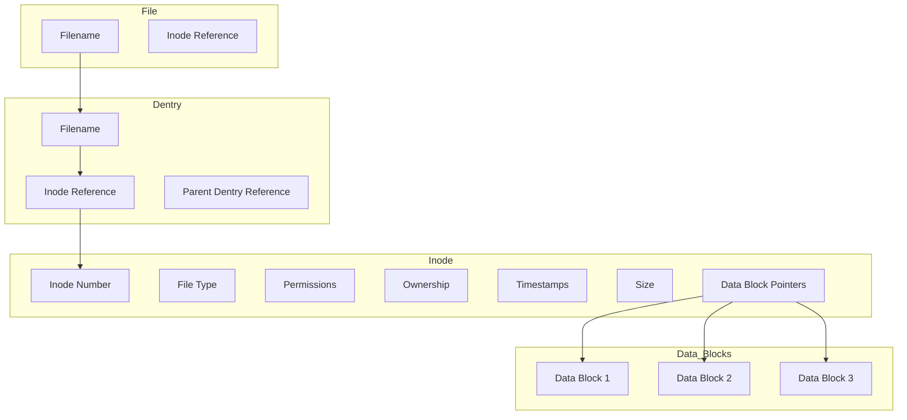

# Linux Filesystem Concepts: Files, Inodes, and Dentries


## 1. Introduction

The Linux filesystem is built upon three fundamental concepts: Files, Inodes, and Dentries. Understanding these components and their relationships is crucial for grasping how the Linux filesystem operates.

## 2. Key Concepts

### 2.1 File

In Linux, everything is treated as a file, including regular files, directories, hardware devices, and sockets. This design simplifies interaction with different entities within the system.

Types of files:
- Regular Files: Contain data or code
- Directories: Special files that maintain a list of other files and directories
- Special Files: Represent device files, FIFOs, sockets, etc.

### 2.2 Inode (Index Node)

An inode is a data structure used to represent a filesystem object. It contains metadata about the object, including:

- File type (regular file, directory, symbolic link, etc.)
- Permissions (read, write, execute attributes)
- Ownership (user ID and group ID)
- Timestamps (creation time, modification time, etc.)
- Size of the file
- Pointers to the data blocks that store the file's content

Every file is associated with a unique inode number.

### 2.3 Dentry (Directory Entry)

A dentry is used for caching directory entries to optimize filesystem lookups. It represents a single file or directory in the cache and contains:

- Inode of the file
- File name
- Pointer to the parent dentry (if applicable)

Dentries help reduce the time taken for path lookups by caching the mapping of file paths to inode numbers.

## 3. Relationship Between File, Inode, and Dentry

1. **File System Namespace**: Structured as a tree where files and directories are organized. Each node in this tree is represented through dentries.

2. **File Metadata and Data**: Managed through inodes. Each file or directory has a corresponding inode that stores its metadata and pointers to its data.

3. **Linking through Dentries**: Dentries link file names to inodes, helping translate human-readable file paths to inode numbers that the system can work with efficiently.

## 4. Python Script: Modeling Linux Filesystem Concepts

The following Python script demonstrates these concepts through three main classes: `File`, `Inode`, and `Dentry`.

```python
class File:
    def __init__(self, name, inode):
        self.name = name
        self.inode = inode

    def read(self):
        data_blocks = self.inode.data_block_pointers
        content = ""
        for block_number in data_blocks:
            content += f"Data Block {block_number}: {disk_space[block_number]}\n"
        return content

    def write(self, data):
        pass  # Not implemented in this abstraction

class Inode:
    def __init__(self, inode_number, file_type, permissions, size, data_block_pointers):
        self.inode_number = inode_number
        self.file_type = file_type
        self.permissions = permissions
        self.size = size
        self.data_block_pointers = data_block_pointers
        self.timestamps = {'creation': None, 'modification': None}

class Dentry:
    def __init__(self):
        self.dentry_cache = {}

    def add_dentry(self, file_name, file):
        self.dentry_cache[file_name] = file

    def lookup_dentry(self, file_name):
        return self.dentry_cache.get(file_name)

# Simulating data blocks on the "disk"
disk_space = {
    1: "Data block 1: The actual content of the file (part 1)...",
    2: "Data block 2: The actual content of the file (part 2)...",
    3: "Data block 3: The actual content of the file (part 3)...",
    4: "",  # Empty data block for directories or unused blocks
    5: "",
    6: "",
}

# Creating Inodes and Files
inode1 = Inode(inode_number=1, file_type='regular file', permissions='rw-r--r--', size=1024, data_block_pointers=[1, 2, 3])
inode2 = Inode(inode_number=2, file_type='directory', permissions='rwxr-xr-x', size=4096, data_block_pointers=[4, 5, 6])

file1 = File(name='file1.txt', inode=inode1)
directory1 = File(name='my_directory', inode=inode2)

# Managing Dentry Cache
dentry_cache = Dentry()
dentry_cache.add_dentry(file1.name, file1)
dentry_cache.add_dentry(directory1.name, directory1)

# Performing Lookup
name_to_lookup = 'file1.txt'
found_entry = dentry_cache.lookup_dentry(name_to_lookup)

if found_entry:
    if found_entry.inode.file_type == 'regular file':
        print(f"File '{name_to_lookup}' found with the following details:")
        print(f"  - Name: {found_entry.name}")
        print(f"  - Inode number: {found_entry.inode.inode_number}")
        print(f"  - File type: {found_entry.inode.file_type}")
        print(f"  - Permissions: {found_entry.inode.permissions}")
        print(f"  - Size: {found_entry.inode.size} bytes")
        print(f"  - Content:\n{found_entry.read()}")
    elif found_entry.inode.file_type == 'directory':
        print(f"Directory '{name_to_lookup}' found with the following details:")
        print(f"  - Name: {found_entry.name}")
        print(f"  - Inode number: {found_entry.inode.inode_number}")
        print(f"  - File type: {found_entry.inode.file_type}")
        print(f"  - Permissions: {found_entry.inode.permissions}")
else:
    print(f"Entry '{name_to_lookup}' not found in the file system.")
```

### Explanation of the Script

1. **File Class**: Represents the file abstraction, linking a filename to its inode. It includes a `read()` method to simulate reading file content from data blocks.

2. **Inode Class**: Simulates the inode data structure, storing metadata about a file including inode number, file type, permissions, size, and pointers to data blocks.

3. **Dentry Class**: Represents the directory entry cache, providing methods to add entries and look up files by name.

4. **Disk Space Simulation**: A dictionary simulates data blocks on a disk, where file content is stored.

5. **Creating Inodes and Files**: The script creates instances of Inodes and Files to represent a regular file and a directory.

6. **Managing Dentry Cache**: Demonstrates how file entries are added to the dentry cache for quick lookup.

7. **Performing Lookup**: Shows how to look up a file in the dentry cache and retrieve its details, including content for regular files.

This script showcases how these components work together to model a basic filesystem structure, demonstrating file creation, lookup, and content retrieval.

## 5. Conclusion

Understanding the relationship between Files, Inodes, and Dentries is fundamental to grasping how the Linux filesystem operates. This model demonstrates:

- How files are associated with inodes containing metadata and data pointers
- How dentries cache directory entries for efficient file lookup
- How data blocks store the actual content of files

While this model is a simplified representation, it provides insight into the core structures that make the Linux filesystem efficient and organized.
