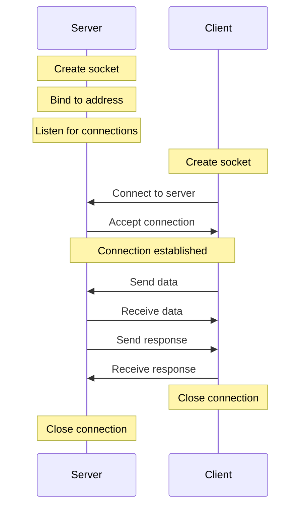

# Socket Programming in Python: A Comprehensive Guide

## 1. Theory

Sockets are communication endpoints that allow processes to exchange data, either on the same machine or across a network. In Linux and other operating systems, sockets are fundamental to network programming.

### Key concepts:

1. **Socket Types:**
   - UNIX domain sockets: For local inter-process communication
   - Internet sockets: For network communication (TCP, UDP)

2. **Address Families:**
   - AF_UNIX: For local communication
   - AF_INET: For IPv4
   - AF_INET6: For IPv6

3. **Basic Socket Operations:**
   - `socket()`: Create a new socket
   - `bind()`: Associate socket with an address
   - `listen()`: Listen for incoming connections (server)
   - `connect()`: Connect to a server (client)
   - `accept()`: Accept incoming connections (server)
   - `send()/recv()`: Send and receive data
   - `close()`: Close the socket

4. **Workflow:**
   - Server: Create socket -> Bind -> Listen -> Accept -> Send/Receive -> Close
   - Client: Create socket -> Connect -> Send/Receive -> Close

### Sockets and the "Everything is a File" Concept

In Unix-like systems, including Linux, there's a fundamental principle known as "everything is a file." This concept extends to sockets as well:

1. **File Descriptors:** When you create a socket, the operating system returns a file descriptor - an integer that uniquely identifies the socket within the process, just like it would for a regular file.

2. **File Operations:** Many of the same system calls used for file I/O can be used with sockets:
   - `read()` and `write()` can be used instead of `recv()` and `send()`
   - `close()` is used to close a socket, just like closing a file
   - `select()` and `poll()` can be used to monitor sockets for activity, along with regular files

3. **Unix Domain Sockets:** These are represented as special files in the file system, typically in the /tmp directory or /var/run.

4. **Network Sockets:** While Internet sockets don't have a direct representation in the file system, they are still treated as file descriptors within the process.

5. **Uniform I/O Model:** This abstraction allows for a consistent interface across different types of I/O, simplifying programming and allowing for powerful techniques like redirecting output from one program to another.

In our socket programming example, we can see this concept at work:

```python
# Creating a socket (creating a file descriptor)
server_socket = socket.socket(socket.AF_INET, socket.SOCK_STREAM)

# Sending data (writing to a file-like object)
conn.sendall(b'Hello from the socket server!')

# Receiving data (reading from a file-like object)
data = conn.recv(1024)

# Closing the connection (closing the file descriptor)
conn.close()
```

Understanding this concept helps in grasping the underlying principles of socket programming in Unix-like systems.

## 2. Schematic Representation

Here's a schematic representation of the socket communication process:



This diagram illustrates the basic flow of a socket-based client-server communication:

1. The server creates a socket, binds it to an address, and starts listening for connections.
2. The client creates a socket and connects to the server's address.
3. The server accepts the incoming connection.
4. Once the connection is established, the client and server can exchange data bidirectionally.
5. Finally, either side can close the connection.

## 3. Implementation

### 3.1 Server Script (server.py)

```python
import socket
from threading import Thread

def handle_client(conn, addr):
    while True:
        # Receiving a message from the client
        data = conn.recv(1024)
        if not data:
            break
        print(f"Received message from {addr}: {data.decode('utf-8')}")
        
        # Sending a response to the client
        conn.sendall(b'Received your message!')
    
    conn.close()
    print(f"Connection with {addr} closed.")

def socket_server():
    # Creating a new socket object using IPv4 and TCP protocols
    server_socket = socket.socket(socket.AF_INET, socket.SOCK_STREAM)
    
    # Setting the SO_REUSEADDR option to allow the socket to be reused immediately
    server_socket.setsockopt(socket.SOL_SOCKET, socket.SO_REUSEADDR, 1)
    
    # Binding the socket to localhost on port 65432
    server_socket.bind(('localhost', 65432))
    
    # Starting to listen for connections
    server_socket.listen()
    print("Server is listening...")

    while True:
        # Accepting a new connection
        conn, addr = server_socket.accept()
        print(f"Connected by {addr}")
        
        # Sending a welcome message to the client
        conn.sendall(b'Hello from the socket server!')
        
        # Creating a new thread to handle the client
        client_thread = Thread(target=handle_client, args=(conn, addr))
        client_thread.start()

# Start the socket server
socket_server()
```

### 3.2 Client Script (client.py)

```python
import socket

def client_chat():
    # Creating a new socket object using IPv4 and TCP protocols
    client_socket = socket.socket(socket.AF_INET, socket.SOCK_STREAM)
    
    # Connecting to the server at localhost on port 65432
    client_socket.connect(('localhost', 65432))
    
    # Receiving a welcome message from the server
    data = client_socket.recv(1024)
    print(data.decode('utf-8'))

    while True:
        # Taking user input and sending it to the server
        msg = input("You: ")
        
        # If the user types "exit", close the connection and exit the loop
        if msg.lower() == "exit":
            break
        
        # Send the user's message to the server
        client_socket.sendall(msg.encode('utf-8'))
        
        # Receiving a response from the server and printing it
        data = client_socket.recv(1024)
        print(f"Server: {data.decode('utf-8')}")

    # Close the socket connection
    client_socket.close()
    print("Connection closed.")

# Start the client chat
client_chat()
```

## 4. Instructions for Network-Wide Access

To make the server accessible over the network:

1. **Find your IP address:**
   - On Linux or macOS: Open a terminal and type `ifconfig` or `ip addr show`

   Look for your IPv4 address, typically starting with 192.168, 10., or 172.

2. **Modify the server binding:**
   In server.py, change:
   ```python
   server_socket.bind(('localhost', 65432))
   ```
   to:
   ```python
   server_socket.bind(('0.0.0.0', 65432))
   ```
   This allows the server to accept connections from any interface.

3. **Configure firewall:** Ensure your firewall allows incoming connections on port 65432.

4. **Run the server:** Execute `python3 server.py` in a terminal.

5. **Modify client connection:**
   In client.py, change:
   ```python
   client_socket.connect(('localhost', 65432))
   ```
   to:
   ```python
   client_socket.connect(('server_ip_address', 65432))
   ```
   Replace 'server_ip_address' with the actual IP address found in step 1.

6. **Share your IP:** Provide your IP address to clients who want to connect.

7. **Run clients:** Clients can now run their client.py script from their own machines.

**Note:** This setup works for local network connections. For internet-wide access, you'd need to configure port forwarding on your router, which can pose security risks if not done carefully.

## 5. Running the Scripts

1. Save the server code in a file named `server.py`.
2. Save the client code in a file named `client.py`.
3. Open two terminal windows: one for the server and one for the client.
4. In the server terminal, navigate to the directory where server.py is located and run:
   ```
   python3 server.py
   ```
5. In the client terminal, navigate to the directory where client.py is located and run:
   ```
   python3 client.py
   ```
6. You should see the welcome message from the server in the client terminal.
7. Start typing messages in the client terminal to communicate with the server.
8. To exit the chat, type "exit" in the client terminal.

 The provided scripts demonstrate a simple chat system using Linux sockets, showcasing the fundamental concepts of socket programming in a practical, interactive way.
